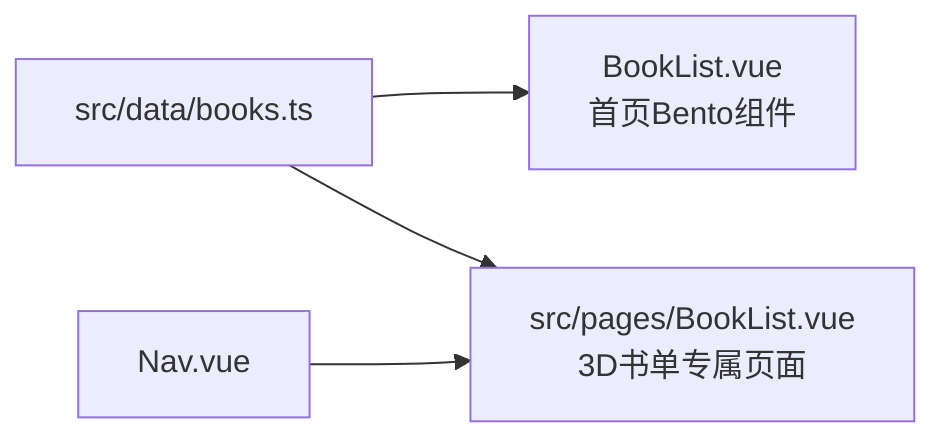

## Product Overview

在博客项目中新增一个专属的"推荐书单"页面，以 3D 翻书效果的交互方式展示书籍数据。页面数据与首页 BookList.vue 组件共享，统一抽取到 `src/data/books.ts`。

## Core Features

- 将 BookList.vue 中的书单数据抽取到 `src/data/books.ts`，BookList.vue 改为从该文件导入
- 新建 `src/pages/BookList.vue` 页面，路由为 `/BookList`
- 页面采用 CSS 3D perspective + transform 实现书籍封面在虚拟书架上的 3D 翻转交互效果（非 WebGL，避免引入未验证的重量级库）
- 点击书籍可展开查看详细信息（标题、作者、描述）
- 支持响应式布局，桌面端展示书架效果，移动端降级为卡片列表
- 在导航菜单"更多"下添加"推荐书单"入口

## Tech Stack Selection

- **3D 效果方案**: CSS 3D Transform（perspective + rotateY）+ Vue transition 动画
- **理由**: 项目已有 CSS 3D Transform 经验（SunRays.vue 使用了 perspective/transform-style: preserve-3d）；three.js 虽在 package.json 中声明但从未在源码中使用过，贸然引入 WebGL 会增加不可控的 bundle 体积和调试成本；CSS 3D 足以实现精美的翻书/书架视觉效果，且兼容性好、性能优
- 其他沿用项目现有技术栈: Vue 3 + Tailwind CSS + Iconify

## Implementation Approach

1. **数据抽取**: 将 BookList.vue 中的 8 本书数据和 Book 接口提取到 `src/data/books.ts`，导出 `Book` 接口和 `books` 数组，供两个组件共享
2. **3D 书架页面设计**:

- 使用 CSS `perspective` 创建 3D 空间
- 书籍封面使用 `transform: rotateY(-Xdeg)` + `transform-origin: left center` 模拟书架上的书脊
- hover 时书本展开（rotateY 趋近 0），展示封面正面
- 点击书籍进入详情模态框，使用 CSS 3D 翻转动画（backface-visibility + rotateY）
- 背景使用毛玻璃效果 + 渐变，保持与项目整体风格一致

3. **BookList.vue 组件同步**: 改为从 `@/data/books` 导入数据，保持首页 Bento 布局中的书单展示不变
4. **导航菜单**: 在 Nav.vue 的"更多"children 数组中新增"推荐书单"项

### Performance

- CSS 3D Transform 由 GPU 加速，不会阻塞主线程
- 书籍封面图片使用 `loading="lazy"` 懒加载
- 无额外 JS 库引入，零额外 bundle 体积

## Architecture Design

数据流: `src/data/books.ts` --> `BookList.vue`(首页组件) + `src/pages/BookList.vue`(专属页面)



## Implementation Notes

- BookList.vue 修改后需确保首页 Bento 布局中组件功能完全不变（翻页、样式等）
- CSS 3D perspective 值建议 1000px-1500px，太大会削弱 3D 效果，太小会导致变形
- 暗色模式支持: 书架背景和详情模态框需适配 dark 模式
- 移动端: 书架效果降级为可点击的卡片列表，避免小屏幕上 3D 效果体验差

## Directory Structure

```
src/
  data/
    books.ts                  # [NEW] 书籍数据模块，导出 Book 接口和 books 数组
  pages/
    BookList.vue              # [NEW] 3D 书单专属页面，CSS 3D 翻书效果
  components/
    bento/common/
      BookList.vue            # [MODIFY] 移除内联数据，改为从 @/data/books 导入
    normal/header/
      Nav.vue                 # [MODIFY] 在"更多"菜单添加"推荐书单"入口
```

## Design Style

采用**暗色调图书馆美学**风格，深色木质书架质感配合暖色光效，营造沉浸式阅读氛围。3D 书架效果使用 CSS perspective 和 transform 实现，无需 WebGL。

### 页面布局

1. **顶部标题区**: 渐变标题"我的书单" + 书籍数量统计
2. **3D 书架区**: 主视觉区域，CSS perspective 创建深度空间，书籍以倾斜角度排列在虚拟书架上，hover 时书本展开显示封面，点击进入详情
3. **书籍详情模态框**: 3D 翻转动画打开，展示封面大图 + 书名 + 作者 + 详细描述
4. **移动端**: 书架降级为卡片网格布局，点击展开详情面板

### 交互设计

- 书籍 hover: 轻微抽出 + 阴影加深 + rotateY 展开角度变化
- 书籍点击: 触发 3D 翻转过渡，打开详情模态框
- 模态框关闭: 反向翻转动画收起
- 页面加载: 书籍依次入场动画（staggered fade-in + slide-up）

### 视觉效果

- 书架背景: 深棕色渐变模拟木质纹理
- 书籍阴影: 多层 box-shadow 模拟立体感
- 环境光: 微弱的顶部渐变光晕
- 暗色模式: 书架色调加深，文字对比度提升